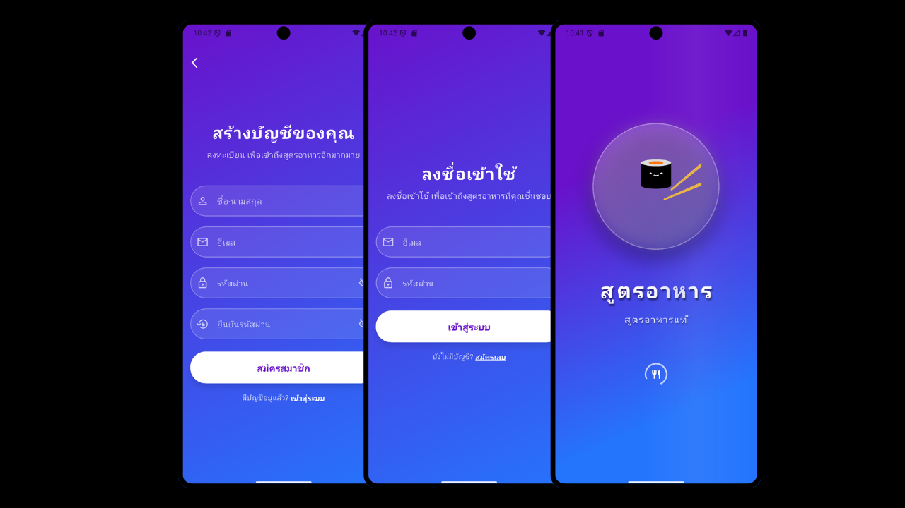
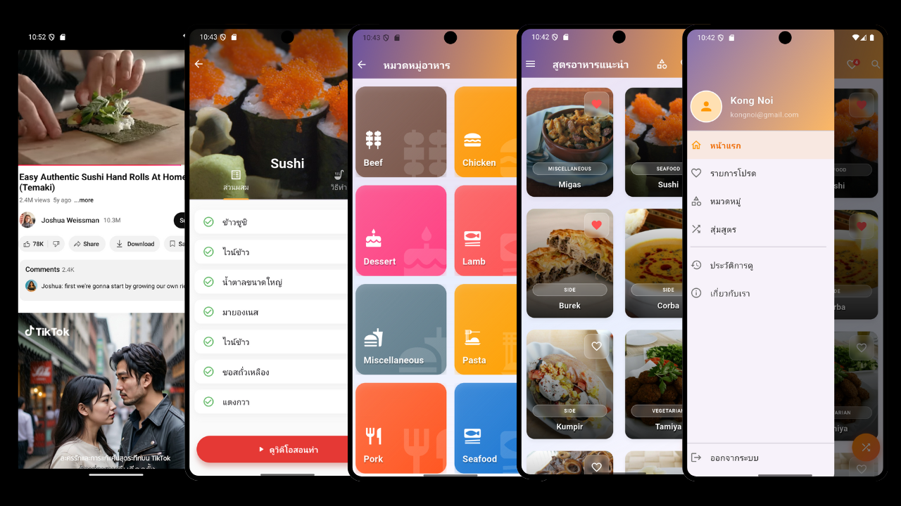

# สูตรอาหาร (Recipe App) 🍳

แอปพลิเคชันสูตรอาหารที่พัฒนาด้วย Flutter เชื่อมต่อกับ TheMealDB API เพื่อให้ผู้ใช้ค้นหาและดูสูตรอาหารจากทั่วโลก พร้อมฟีเจอร์การแปลภาษาไทยอัตโนมัติและ UI/UX ที่สวยงามทันสมัย

## 👥 ทีมพัฒนา
**ทีม: ก้องน้อย นอนนา**
1. นายธนาสุข เครือศรี - 6612732113
2. นายประสพผล ตาลหอม - 6612732118
3. นายวรพล พรหมคุณ - 6612732125
4. นางสาววรรณกานต์ สมทิพย์ - 6612732139

**สาขาวิทยาการคอมพิวเตอร์ คณะศิลปศาสตร์และวิทยาศาสตร์ มหาวิทยาลัยราชภัฏศรีสะเกษ**  

## 📦 Packages หลักที่ใช้

| Package | ประโยชน์ |
|---------|---------|
| **provider** | การจัดการสถานะ (State Management) หลักของแอป |
| **http** | การเชื่อมต่อกับ TheMealDB API เพื่อดึงข้อมูลสูตรอาหาร |
| **shared_preferences** | การบันทึกข้อมูลแบบ Local สำหรับสถานะล็อกอิน, รายการโปรด, และประวัติการดู |
| **cached_network_image** | การจัดการ Cache รูปภาพจากอินเทอร์เน็ตเพื่อประสิทธิภาพที่ดีขึ้น |
| **lottie** | การแสดงผล Animation คุณภาพสูง (ไฟล์ JSON) |
| **flutter_staggered_animations** | การสร้าง Animation สำหรับรายการ (List/Grid) ให้ดูมีชีวิตชีวา |
| **translator** | การแปลข้อมูลสูตรอาหารจากภาษาอังกฤษเป็นภาษาไทยอัตโนมัติ |
| **url_launcher** | การเปิดลิงก์ภายนอก เช่น วิดีโอ YouTube |
| **package_info_plus** | การดึงข้อมูลเวอร์ชันของแอปมาแสดงผล |

## 📱 คำอธิบายโปรเจกต์

**แอปสูตรอาหาร (Recipe App)** เป็นแอปพลิเคชันสำหรับค้นหาและดูสูตรอาหารจากทั่วโลก พัฒนาด้วย Flutter โดยเชื่อมต่อกับ TheMealDB API เพื่อดึงข้อมูลสูตรอาหารที่หลากหลาย มีฟีเจอร์สำหรับผู้ใช้ในการสร้างบัญชี, จัดการรายการโปรด, และดูประวัติการเข้าชม พร้อมทั้งยกระดับประสบการณ์ผู้ใช้ด้วยการแปลข้อมูลเป็นภาษาไทยอัตโนมัติ และมี User Interface ที่สวยงามทันสมัย

## ✨ ฟีเจอร์หลัก

- 🌐 **เชื่อมต่อ API ภายนอก**: ดึงข้อมูลสูตรอาหารแบบ Real-time จาก TheMealDB
- 🔐 **ระบบสมาชิก**: สมัครสมาชิก, เข้าสู่ระบบ และออกจากระบบ
- ❤️ **รายการโปรด**: บันทึกสูตรอาหารที่ชื่นชอบไว้ดูภายหลัง
- 📜 **ประวัติการดู**: บันทึกและแสดงรายการสูตรอาหารที่เคยดูแล้วโดยอัตโนมัติ
- 🔍 **การค้นหา**: ค้นหาสูตรอาหารจากชื่อได้อย่างรวดเร็ว (Client-side search)
- 🗂️ **หมวดหมู่**: เลือกดูสูตรอาหารตามหมวดหมู่
- 🔀 **สุ่มสูตรอาหาร**: ค้นพบสูตรอาหารใหม่ๆ ด้วยฟังก์ชันสุ่ม
- 🇹🇭 **แปลภาษาอัตโนมัติ**: แปลวิธีทำและส่วนผสมเป็นภาษาไทยเพื่อความสะดวกของผู้ใช้
- ▶️ **ดูวิดีโอ**: เปิดลิงก์วิดีโอสอนทำอาหารบน YouTube ได้โดยตรงจากแอป
- ✨ **UI/UX ทันสมัย**:
  - ใช้ Lottie สำหรับ Animation ที่สวยงาม
  - ใช้ Staggered Animation สำหรับการแสดงผลรายการ
  - ใช้ Hero Animation เพื่อการเปลี่ยนหน้าที่ไร้รอยต่อ
  - มีดีไซน์แบบ Glassmorphism ที่ทันสมัย

## 🏗️ ตัวอย่างโค้ดสำคัญ

### โมเดล Meal
```dart
// lib/models/meal_model.dart
class Meal {
  final String id;
  final String name;
  final String category;
  final String instructions;
  final String imageUrl;
  final List<String> ingredients;
  final String? youtubeUrl;

  Meal({
    required this.id,
    required this.name,
    required this.category,
    required this.instructions,
    required this.imageUrl,
    required this.ingredients,
    this.youtubeUrl,
  });

  factory Meal.fromJson(Map<String, dynamic> json) {
    List<String> ingredients = [];
    for (int i = 1; i <= 20; i++) {
      if (json['strIngredient$i'] != null && json['strIngredient$i'].isNotEmpty) {
        ingredients.add(json['strIngredient$i']);
      }
    }

    return Meal(
      id: json['idMeal'],
      name: json['strMeal'],
      category: json['strCategory'] ?? '',
      instructions: json['strInstructions'] ?? '',
      imageUrl: json['strMealThumb'] ?? '',
      ingredients: ingredients,
      youtubeUrl: json['strYoutube'],
    );
  }
}
```

### การจัดการข้อมูลด้วย Provider (FavoritesProvider)
```dart
// lib/providers/favorites_provider.dart
class FavoritesProvider with ChangeNotifier {
  final FavoritesService _favoritesService = FavoritesService();
  List<Meal> _favoriteMeals = [];
  
  List<Meal> get favoriteMeals => _favoriteMeals;

  FavoritesProvider() {
    loadFavorites();
  }

  Future<void> loadFavorites() async {
    _favoriteMeals = await _favoritesService.getFavorites();
    notifyListeners();
  }

  Future<void> addFavorite(Meal meal) async {
    if (!isFavorite(meal.id)) {
      await _favoritesService.addFavorite(meal);
      _favoriteMeals.add(meal);
      notifyListeners();
    }
  }

  Future<void> removeFavorite(String mealId) async {
    await _favoritesService.removeFavorite(mealId);
    _favoriteMeals.removeWhere((meal) => meal.id == mealId);
    notifyListeners();
  }

  bool isFavorite(String mealId) {
    return _favoriteMeals.any((meal) => meal.id == mealId);
  }
}
```

### การเชื่อมต่อ API ด้วย Service (MealService)
```dart
// lib/services/meal_service.dart
class MealService {
  static const String _baseUrl = 'https://www.themealdb.com/api/json/v1/1';
  static const Duration _timeout = Duration(seconds: 10);

  Future<Meal> fetchMealDetail(String id) async {
    try {
      final response = await http
          .get(Uri.parse('$_baseUrl/lookup.php?i=$id'))
          .timeout(_timeout);
      
      if (response.statusCode == 200) {
        final data = json.decode(response.body);
        List meals = data['meals'];
        
        if (meals.isNotEmpty) {
          return Meal.fromJson(meals[0]);
        } else {
          throw Exception('Meal not found');
        }
      } else {
        throw Exception('Server error: ${response.statusCode}');
      }
    } catch (e) {
      throw Exception('Network error: $e');
    }
  }
}
```

### เทคนิคพิเศษ: การ Sanitize ไฟล์ Lottie (SplashScreen)
```dart
// lib/screens/splash_screen.dart
// โหลดไฟล์ Lottie แล้วบังคับให้ w/h ที่ระดับ root, layers (precomp), assets เป็น int
Future<Uint8List> _loadSanitizedLottie(String assetPath) async {
  final raw = await rootBundle.loadString(assetPath);
  final dynamic data = jsonDecode(raw);
  
  if (data is! Map<String, dynamic>) {
    throw StateError('Invalid Lottie JSON root');
  }
  
  _sanitizeLottieMap(data);
  final fixed = jsonEncode(data);
  return Uint8List.fromList(utf8.encode(fixed));
}

void _sanitizeLottieMap(Map<String, dynamic> node) {
  // ... implementation to fix w/h values ...
}
```

## 🚀 การติดตั้งและรันโปรเจกต์

### ความต้องการของระบบ
- Flutter SDK (เวอร์ชันล่าสุดที่เสถียร)
- Dart SDK
- Android Studio / VS Code
- Android emulator หรืออุปกรณ์จริง

### วิธีการติดตั้ง

1. **Clone โปรเจกต์**
```bash
git clone <repository-url>
```

2. **เข้าไปยังโฟลเดอร์โปรเจกต์**
```bash
cd recipe_app
```

3. **ติดตั้ง dependencies**
```bash
flutter pub get
```

4. **รันแอปพลิเคชัน**
```bash
flutter run
```

## 📱 การใช้งาน

### 1. การยืนยันตัวตน
- เปิดแอปครั้งแรก: Splash Screen → หน้า Login
- หากยังไม่มีบัญชี: กด "สมัครเลย" เพื่อไปยังหน้า Register

### 2. หน้าหลัก
- เมื่อเข้าสู่ระบบแล้ว: จะพบกับรายการสูตรอาหารทั้งหมด
- ใช้ Drawer (เมนูซ้าย) เพื่อไปยังส่วนต่างๆ

### 3. การค้นหา
- กดไอคอนแว่นขยายที่ AppBar เพื่อเปิดช่องค้นหา
- พิมพ์ชื่ออาหารที่ต้องการ

### 4. การจัดการ
- **ดูรายละเอียด**: กดที่การ์ดอาหารเพื่อไปยังหน้า Meal Detail
- **เพิ่ม/ลบรายการโปรด**: กดไอคอนรูปหัวใจที่การ์ดอาหาร หรือที่หน้า Meal Detail
- **ดูวิดีโอ**: กดปุ่ม "ดูวิดีโอสอนทำ" ที่หน้า Meal Detail

## 📸 ตัวอย่างหน้าจอ User Interface



## 📸 ตัวอย่างหน้าจอ User Interface



## 📝 License

โปรเจกต์นี้ใช้สำหรับการศึกษาเท่านั้น
